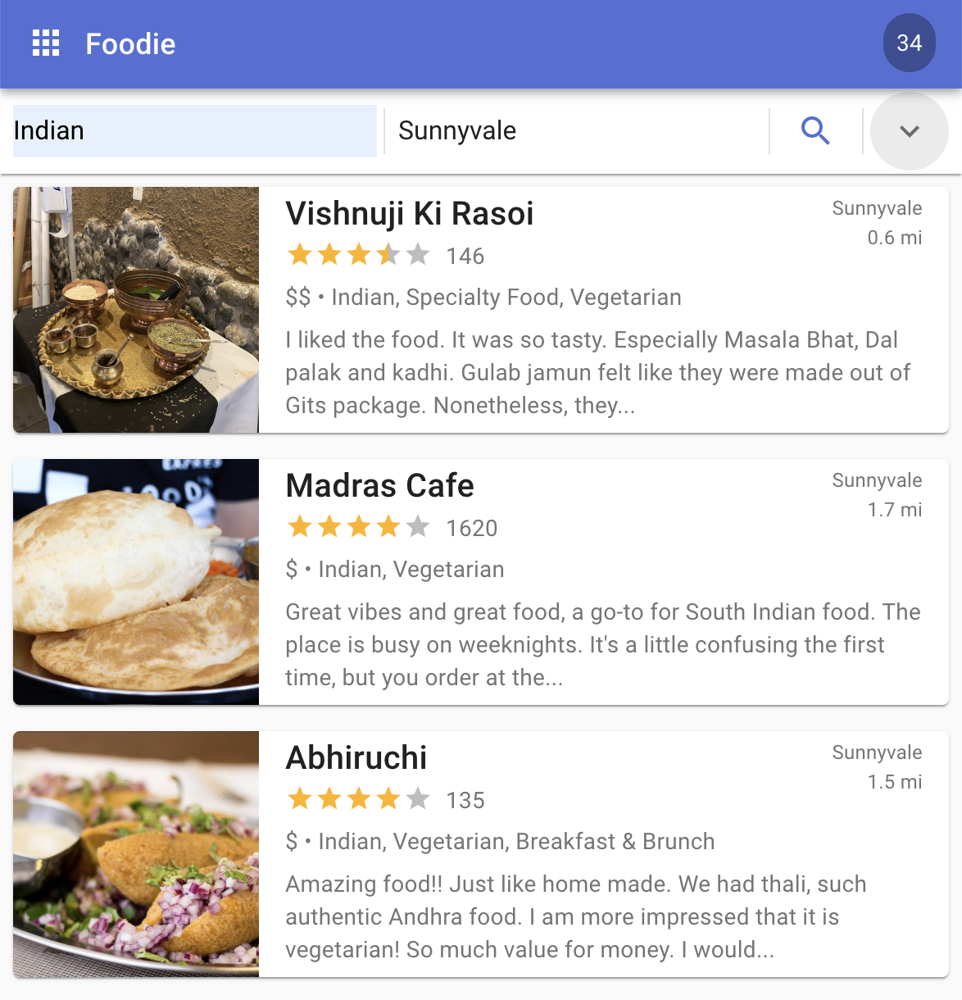

# Foodie - React Web

Foodie is a demo application for finding restaurants using Yelp's GraphQL API.
We have built it on several tech stacks in order to compare and contract
technologies. This one is built on:

-   React
-   Material-UI



## Build

-   Install dependencies

```bash
yarn
```

-   Create env.js

```bash
cp config/env.js public/env.js
```

Now edit `public/env.js` and enter your Yelp access token as the value of
ACCESS_TOKEN

-   Start the Foodie app

```bash
yarn start
```

Now point your browser to http://localhost:3000/.
